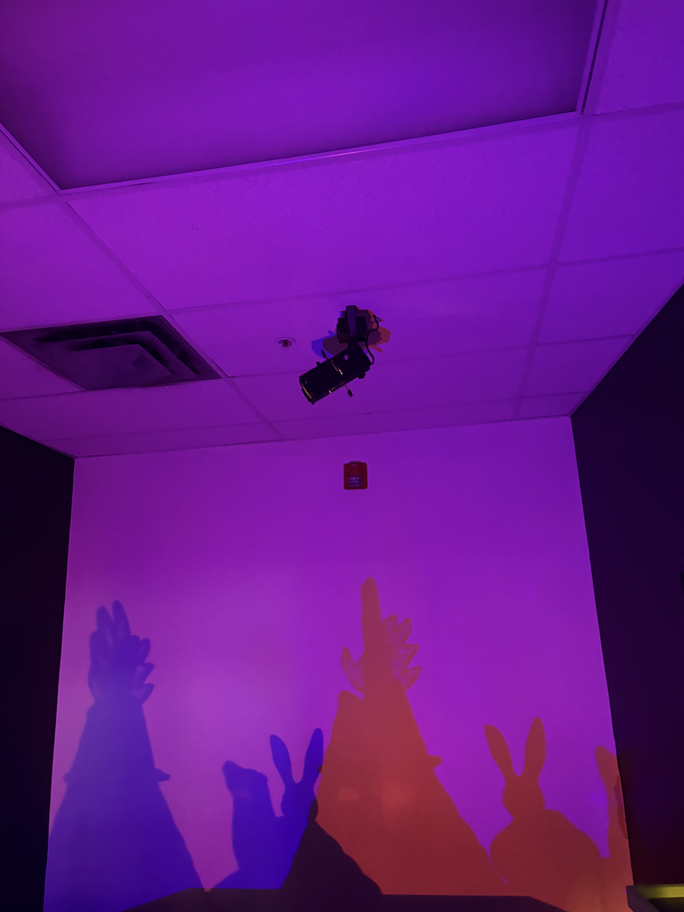
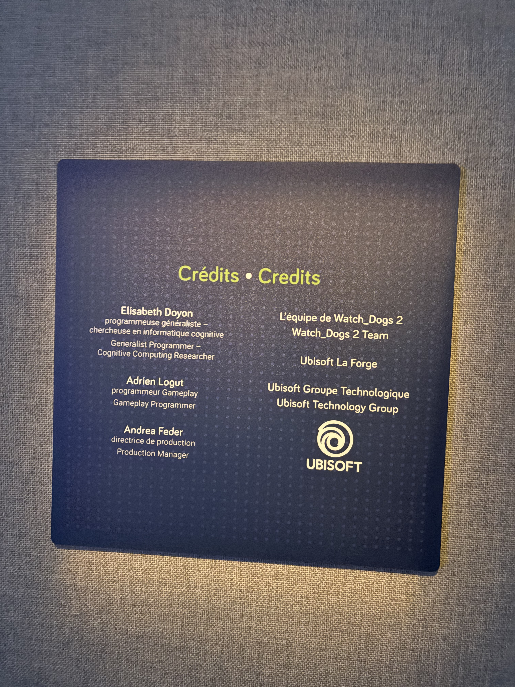
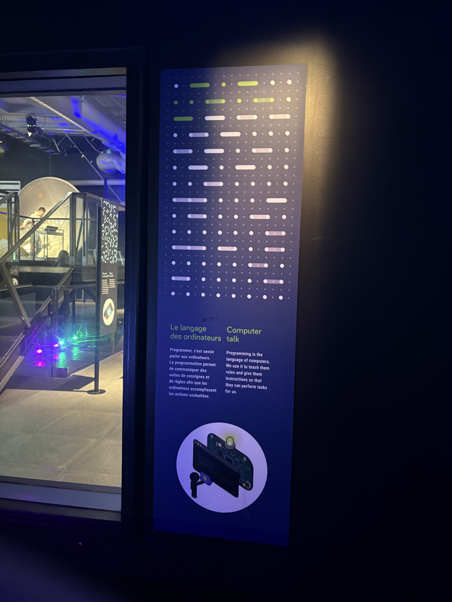
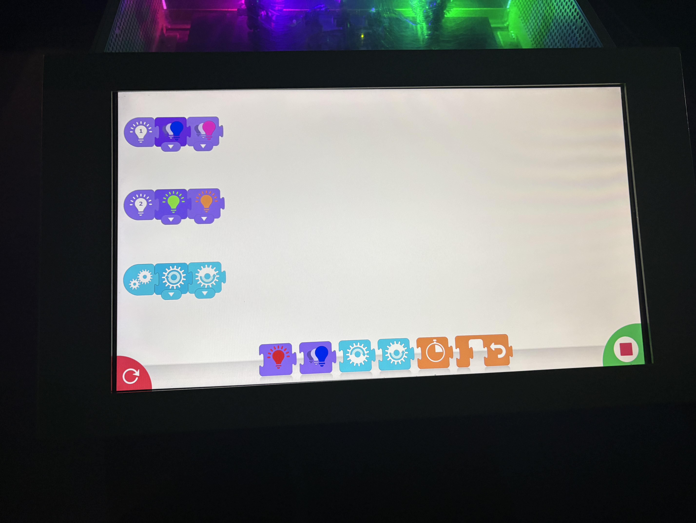

# Dispositif Le langage des ordinateurs de la firme UBISOFT. Présenter au Centre des sciences de Montréal.

>Photo que j'ai prise de la zone de projection de l'oeuvre. / photos toutes prise le 29 decembre 2025.

## Information general sur le dispositif.

>Photos de la fiche d'information de l'oeuvre / Photos de Loïc Valois.

- Nom de la firme: Ubisoft (l'équipe de Watch_Dogs 2) 
- Type d'exposition: permanente 
– Date de présentation et lieu : les jours d'ouverture du Centre des sciences de Montréal.
- Année de production de l'oeuvre: 2020

## Comment le dispositif a été pensé.

Ce dispositif est pensé avec le vouloir de captiver l'attention de l'utilisateur (souvent de jeune âge dans le cas de ce dispositif) en lui donnant un contrôle absolu ou presque sur ce que le jeu d'ombres sera devant lui en finalité L'interface de codage a été simplifiée dans le but de rendre le codage accessible à tous en donnant la base de la pensée nécessaire pour coder. Ils ont aussi été pensés dans le but de faire travailler l'esprit logique du jeune qui tente de l'utiliser. Pour finir, il est pensé pour démontrer une possibilité de carrière ou de loisir dans l'espoir de créer un intérêt à long terme chez l'utilisateur.

## Mon expérience personnel de l'oeuvre.

cliquer sur l'image pour voir la vidéo

>vidéo de moi qui tente d'utiliser le dispositif / Prise de Loïc Valois.

— Je dirais que le premier regard que j'ai posé sur ce dispositif était très positif, car je trouve que l'approche qu'ils ont utilisée pour rendre la programmation plus interactive est bien pensée.
– Malheureusement quand j'ai tenté de l'utiliser la deuxième fois, le dispositif ne répondait tout simplement pas. Ce qui m'a un peu cassé mon expérience.
— Je trouve que c'était pas mal car ça permet au cerveau de voir de manière très concrète et physique l'impact du code qu'il peut faire.

## Ce qui est nécessaire en termes de matériel pour faire l'œuvre.

>Croquis vite fait de l'instalation de l'oeuvre / fait par Loïc Valois.

- Un pc
- Une petite maquette 
– Deux lumières de couleur. 
– Un projecteur (au plafond pour la fiche sur le côté
– Un air de projection pour les ombres (un mur blanc).
– Un moteur bidirectionnel.
– Un fils HDMI.
– Minimum 2 prises électriques
– Un écran tactile.
– Les fils pour connecter les moteurs et la lumière au PC.
– Un habitacle pour rendre le PC moins accessible (limiter les casses).
- Une salle plus sombre

## Ce que je trouve intéressant à garder dans l'œuvre.

1. Je trouve que le côté interactif de l'œuvre est vraiment un point fort.
2. Je trouve que l'interface graphique était simple et compréhensible sans trop être limitante au niveau code pour des enfants qui découvrent le code.
3. Je pense que mettre le dispositif dans une pièce séparée est une bonne idée, ça donne une atmosphère plus calme pour permettre de mieux se concentrer sur le dispositif.

## Ce que je pense qui pourrait être amélioré.

1. Je n'aime pas le fait qu'elle marche pas constamment.
2. J'aurais aimé plus de paramètres à jouer avec (par exemple : moteur pour modifier la hauteur de certaines parties de la maquette qui sert à faire de l'ombre).
3. Je pense qu'il serait intéressant de créer un moment pour le rendre possible à utiliser à plusieurs en même temps (en collaboration). 

## Référence

– Les photos que j'ai prises, les informations qui étaient présentes sur le lieu d'exposition et des recherches pour savoir quand la zone Explore a été créée.
