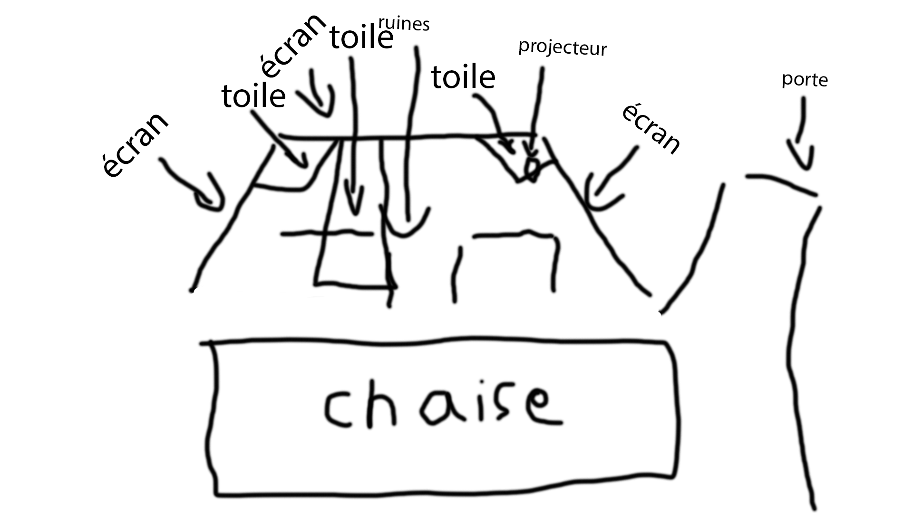

# Fiche du film multimédia du musée de Pointe-À-Callière qui porte le nom de: Générations MTL.

>Photo que j'ai prise de l'emsemble de l'instalation de l'oeuvre (Il manque beaucoup d'equipement qui ne pouvais simplement pas être dans le chant de la cameras ou simplement vue) / photos et vidéo toutes prise le 8 mars 2026 par Loïc Valois.

## Information general sur l'oeuvre.

- Type d'exposition: permanente
- Date presentation et lieu: en permanence au musée de pointe-à-calière
- Année de production de l'oeuvre: pas réussie a trouver cette information

## Comment l'instalation a été penser.

>Photo qui montre au bonne partie de l'installation.­

Premièrement, l'instalation pour se film multimédia a été penser autour du thème des années ils est donc séparer en trois partie en quelle que sorte. Je trouvais que cette méthode placement est penser pour pouvoir séparer les différente étapes des années/siècles qui sont présenter durent le la suite historique qui est présenter durant se film. L'instalation a été fais aussie en forme de U pour donner une impresion d'immersion dans l'histoire présenter (impression qui selont moi est réussie). Pour le reste je dirait que l'instalation a été penser autour des ruinnes qui se trouve au pied de l'instalation pour donner une impression de (fusion) avec l'histoire de ses ruines.

## Mon expérience personnel de l'oeuvre.

>vidéo d'une partite partie du spectacle / Vidéo de Loïc Valois.

- Je dirais que j'ai adorer rentrer dans la piece de l'instalation, la porte avait une sorte de prestance et il y avait des petite iluminations sur le dispositif avant meme que cela commence se qui donnait une impression de professionel et propre que jai rarement vue.
- durant la diffusion, j'ai bien apprécier du débuts a la fin (j'aurais adoré que mes cours d'histoire soit fais comme cela.
- J'ai d'ailleur bien aimer comment tout étais simple mais complet dans la salle pour rendre tout accesible.

## Se qui est nécésaire en terme de matériel pour faire l'Instalation.

>Croquis vite fait de l'instalation / fait par Loïc Valois.

- Un pc ou plusieur pc (je saurait pas dire exactement se qui est nécésaire en terme de composant.)
- Plusieur projecteurs (j'ai aucun moyen de savoir combien exactemetn mais j'estime entre 7 a 10)
- Environ 5 ranger de sieges placer en estrade.
- Des projecteur de lumière ( acune ider combiens )
- Une air de projection
- Une herse au plafont ou juste des moyens de maintenir en place les projecteur et autre équipement.
- Un nombre de fils hdmi qui est m'est inconue.
- Beaucoup de courant et beaucoup de circuit electrique différent pour s'assurer de la fiabiliter de l'instalation
- De nombreux frames de metals de forme différente.
- De nombreuse toile de tissue opaque (pour les ecrant a l'arrière)
- Trois toile de forme différente qui ne sont pas opaque.
- De nombreux miroir.
- Beaucoup de bouton.
- Beaucoup de casque audio avec fils en fer.
- Un certain nombre de haut parleur. (mais je nais aucune ider combiens)
- Des ruines
- Sols en tapis
- Une barrière

## Se que je trouve interessant a garder dans l'oeuvre.

>Petite vidéo qui montre les instructions qui sont donner au débuts de la scéance.

1. Je trouve que l'hestétique de l'instalation est définitivement a garder.
2. je trouve que l'ider de présenter des sujets qui n'interest pas tout le monde du manière qui donne l'impression qu'ils sont face a quelle que chose d'important et de plus plaisant.
3. J'ai adorer a quelle point l'instalation étais facile a utiliser pour tout le monde.

## Se que je pense qui pourrait être améliorer.

1. je n'aime pas le manque d'humain dans le processus de présentation du film.
2. j'aurais aimer que l'oeuvre soit un peut plus présise su rchaque évenement qu'ils y ais présenter.
3. J'airait bien aimer qu'il y ais de haut parleur a larrière en plus de l'avant pour avoir un effect imersif complet.
4. J'aurais bien aimer que les ruines soit utiliser dans le film et qui ne serve pas que de decort.

## Référence

- Se que j'ai vue dans la salle de l'installation, les photos que j'ai prit et le site de l'exposition su rle site de pointe-à-calière.
