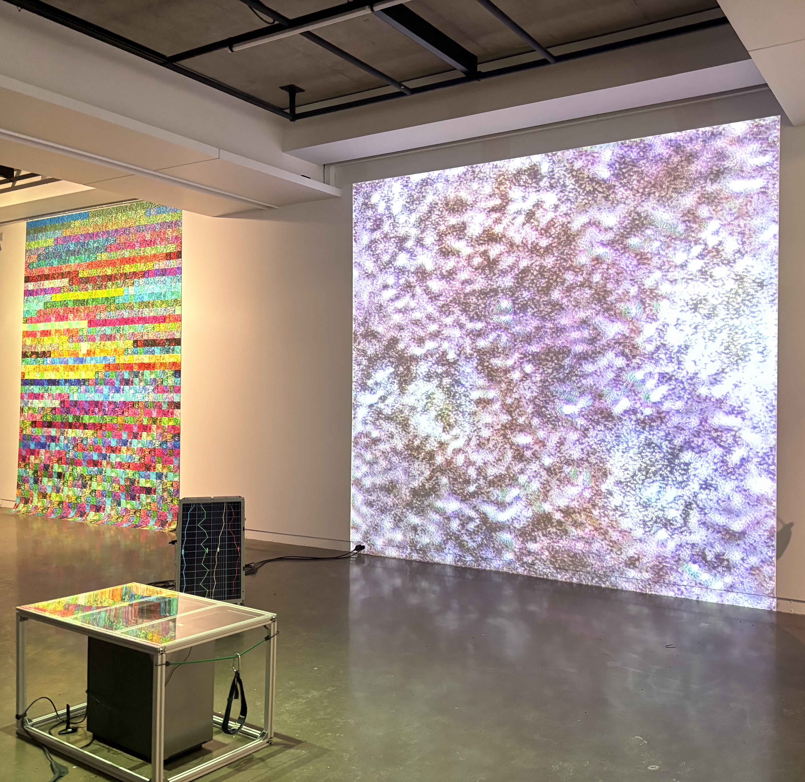
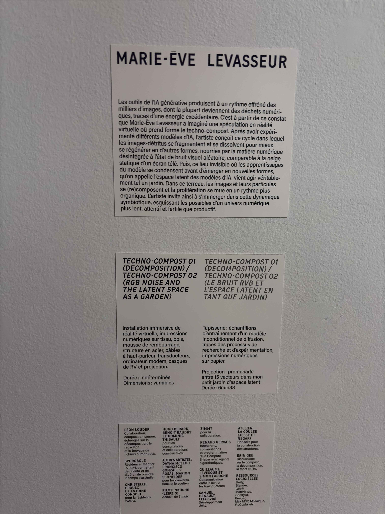
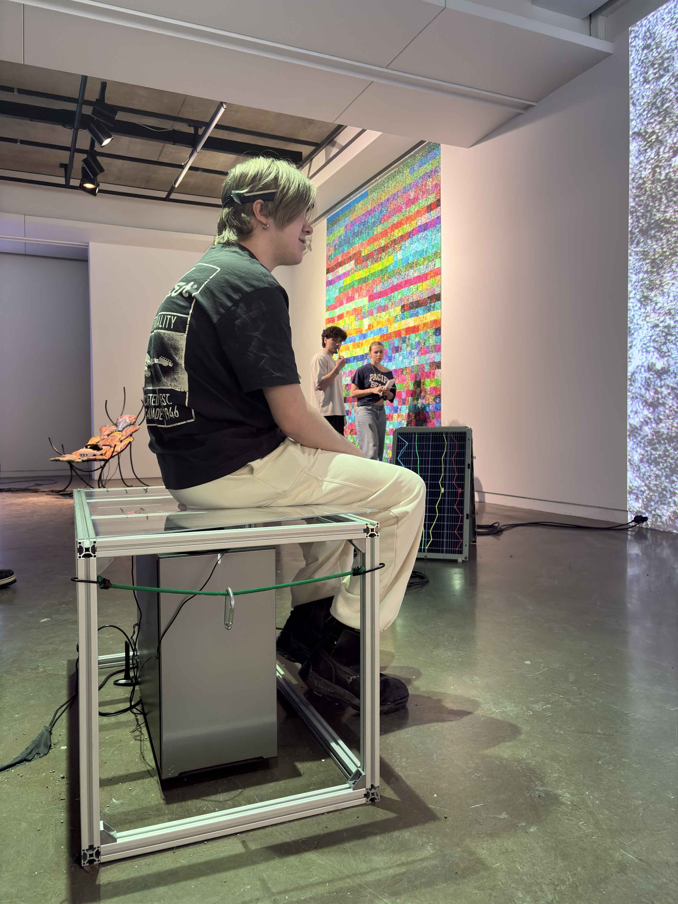
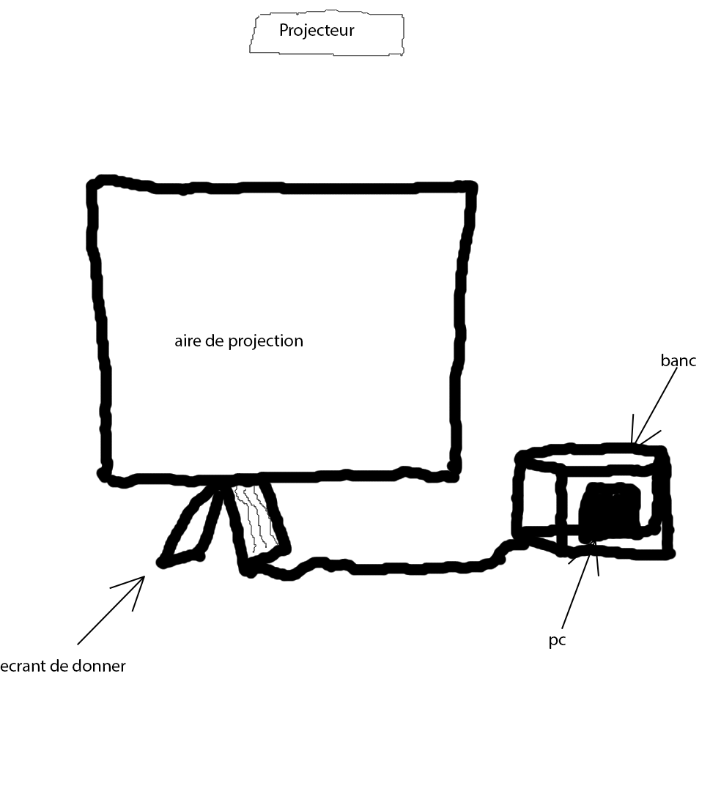

# Oeuvre techno compost de la galerie de l'universiter de montréal   par Marie ève Levasseur.

>Photo que j'ai prise de l'emsemble de l'instalation de l'oeuvre (Il manque un projecteur qui est en dehors du frame mais sinon tout est la).

## Information general sur l'oeuvre.

>Photo de la fiche d'information de l'oeuvre / Photo de Loïc Valois.

- Nom de l'artiste: Marie ève Levasseur
- Type d'exposition: temporaire
- Date presentation et lieu: du 28 novembre 2025 au 28 fevrier 2026 Galerie de l’UdeM
- Année de production de l'oeuvre: 2025

## Comment l'oeuvre a été penser.

Premièrement, l'oeurvre est intéractive en quelle que sorte. Elle l'est par le bias d'un bando électronique qui sert a détecter les ondes alpha du cerveaux humain (onde alpha= sommeil et méditation). Se bando envoie alors ensuite ses information a un ordinateur qui fait bouger plus ou mouin vite des image a l'avant de la personne en fonction des donner. Le pc envoie aussie les donner a un tableux graphique qui est physiquement positioner a la gauche de la personne avec le bando (ce panneau a surement été placer pour permettre au cantifiquation plus simple pour les usager de l'oeuvre soit pour permettre une meilleur demonstration ou pour tenter de motiver une sorte de compétion cher l'usager). Parlant de competition, La médiatrice te fais une sorte de chalenge en te présentent l'oeuvre "seras tu capable de calmer la machine ?" 

## Mon expérience personnel de l'oeuvre.

>Photo d'un étudiant qui est entrein d'intéragir avec l'oeuvre / Photo de Loïc Valois.

- Je dirais que le premier regard que j'ai poser sur cette oeuvre étais pas vraiment positif (sa ma prit un certain moment a comprendre de quoi il sagisait.)
- Quand je comprit finalement enfin le concept (qui savère a être un détecteur d'onde alpha) mon regard sur l'oeuvre a changer drastiquement. Je l'ai prit comme un défie de se calmer (car les ondes alpha sont celle du sommeil et de la méditation).
- Je trouve que cétais pas mals car a plusieur moment plusieur personne se trouvais a l,entour du dispositif pour voir les autres personnes tenter de calmer en quelle que sorte la machine. Se qui je trouve est manifique en terme de contact humain ses un bon moyen de se regrouper.

## Se qui est nécésaire en terme de matériel pour faire l'oeuvre.

>Croquis vite fait de l'instalation de l'oeuvre / Photo de Loïc Valois.

- Un pc (je saurait pas dire exactement se qui est nécésaire en terme de composant.
- Un bando capable de capter les ondes alpha (a baterie et connectable)
- Un banc creus pour pouvoir mettre le pc en dessous.
- Un projecteur ( au plafont )
- Une air de projection
- Une herse au plafont (pour le projecteur)
- Un fils hdmi
- Minimum 3 prise électrique
- Un panneau graphique
- Le fils pour connecter le panneau au pc

## Se que je trouve interessant a garder dans l'oeuvre.

1. je trouve que le côter interactif de l'oeuvre est vraiment un de ses point fort.
2. je trouve que l'installation étais asser bien penser se qui aide a l'imersion.
3. je pense que laisser de la liberter a l'intelligence artificielle peut être quelle que chose d'interressant a travailler dessue a l'avenir.

## Se que je pense qui pourrait être améliorer.

1. je n'aime pas le fais que la seule influence humaine sur l'image montrer soit la vitesse de défilement j'aurais aimer que sa soit produit en tout temps.
2. j'aurais aimer que l'oeuvre est plus de chose qui capte l'attention pour faire en sorte que le personne veulent rester plus longtemps a regarger l'oeuvre.
3. J'airait bien aimer qu'il y ais bien plus dondes qui soit percue ( de préference une que l'ont pourrais controler consiament pour donner une plus grade impression de controle.

## Référence

- Juste les photos que j'ai prise et les informations qui étais présente sur le lieux d'exposition.
