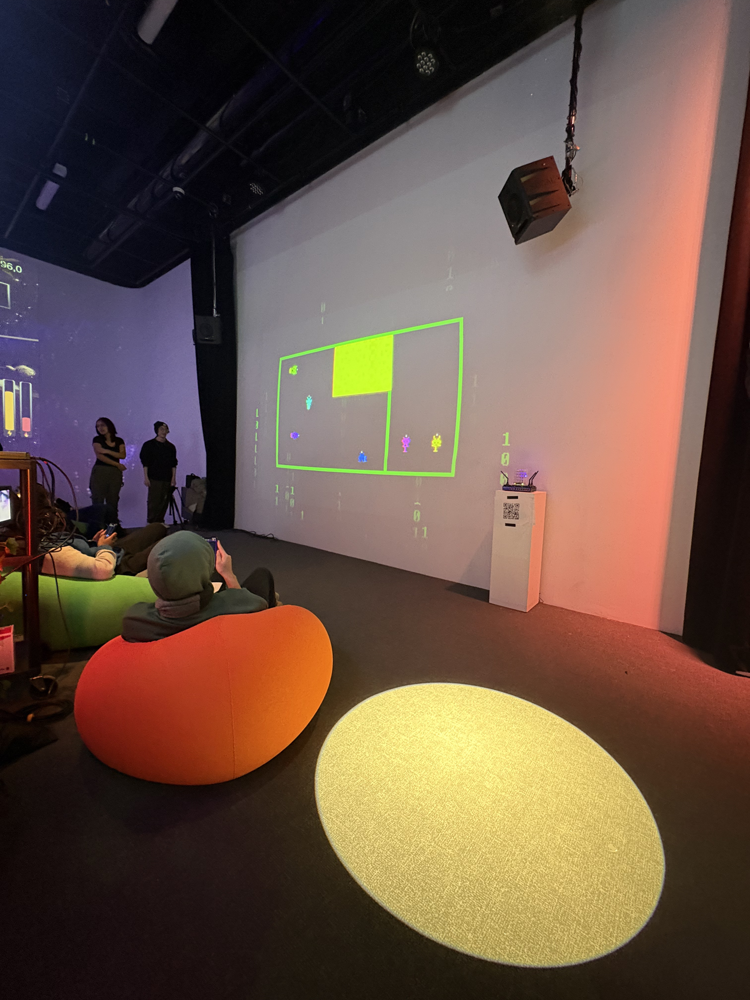

# Dispositif Terminale fait par les étudiants de TIM du cégep de Montmorency.

>Photo que j'ai prise de l'emsemble de l'instalation du dispositif / photos toutes prise le 18 mars 2026.

## Information general sur le dispositif.

- Nom des auteurs:

  

- Émeryk Bélisle,

- Elie Daher,

- Ting Yung Lu Terry,

- Dana Saavedra-Torrano,

- Mégane Ranger

  

- Type d'exposition: temporaire

– Date de présentation et lieu : du 16 au 19 mars 2026 au Grand Studio du Cégep Montmorency.

- Année de production de l'oeuvre: 2025/2026

## Comment le dispositif a été pensé.

Ce dispositif est pensé avec le vouloir de faire s'entraider plusieurs personnes (qui ne se connaissent pas forcément) au travers de plusieurs niveaux de plus en plus durs.

## Mon expérience personnel de l'oeuvre.

>vidéo de moi qui tente d'utiliser le dispositif / Prise de Loïc Valois.

— Je dirais que le premier regard que j'ai posé sur ce dispositif était très positif, car je trouve que l'idée de faire un jeu coopératif est bien selon moi.

— Je trouve que le dispositif est bien pensé car les contrôles sont simples à comprendre, peu importe l'âge.

— Je trouve que le dispositif est aussi bien à regarder qu'à utiliser car on a l'impression de voir nous il y a deux minutes.

## Ce qui est nécessaire en termes de matériel pour faire l'œuvre.

>Croquis prit sur leur site github/ fait par Loïc Valois.

- Un pc

- Un routeur wi-fi 

– Des appareils en mesure de se connecter au wi-fi (amenés par les utilisateurs).

- Un projecteur

– De haut-parleur amplifié (2).

- Un sender/receiver

– Un fils HDMI.

– Des câbles Ethernet (3-4).

– Deux câbles XLR.

- Des cables d'alimentation

- Un multiprise

– Une lumière plafond américaine DJ.

– Des bâtons de lumière (2-4).

- Une boite de lumière

– Des rallonges pour lumière (2-4).

– Des power supplies pour les lumières.

- Des boules de connections de lumière

– Une carte graphique extérieure.

## Ce que je trouve intéressant à garder dans l'œuvre.

1. Je trouve que le côté interactif de l'œuvre est vraiment un point fort.

2. Je trouve que l'interface graphique était simple et compréhensible.

3. Je pense que la disposition du dispositif est à garder car elle permet naturellement d'avoir un public.

## Ce que je pense qui pourrait être amélioré.

1. Il y a quelques bugs.

2. J'aurais aimé avoir une option pour jouer même si je n'avais pas mon téléphone.

3. Je pense qu'il serait intéressant de créer certaines interactions physiques (par exemple : un bouton ou une roulette).

## Référence

- Les photos que j'ai prises et les informations qui étaient présentes sur leur site GitHub.

