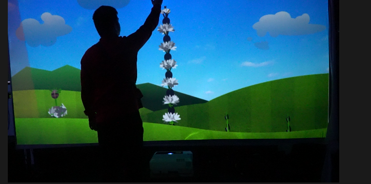
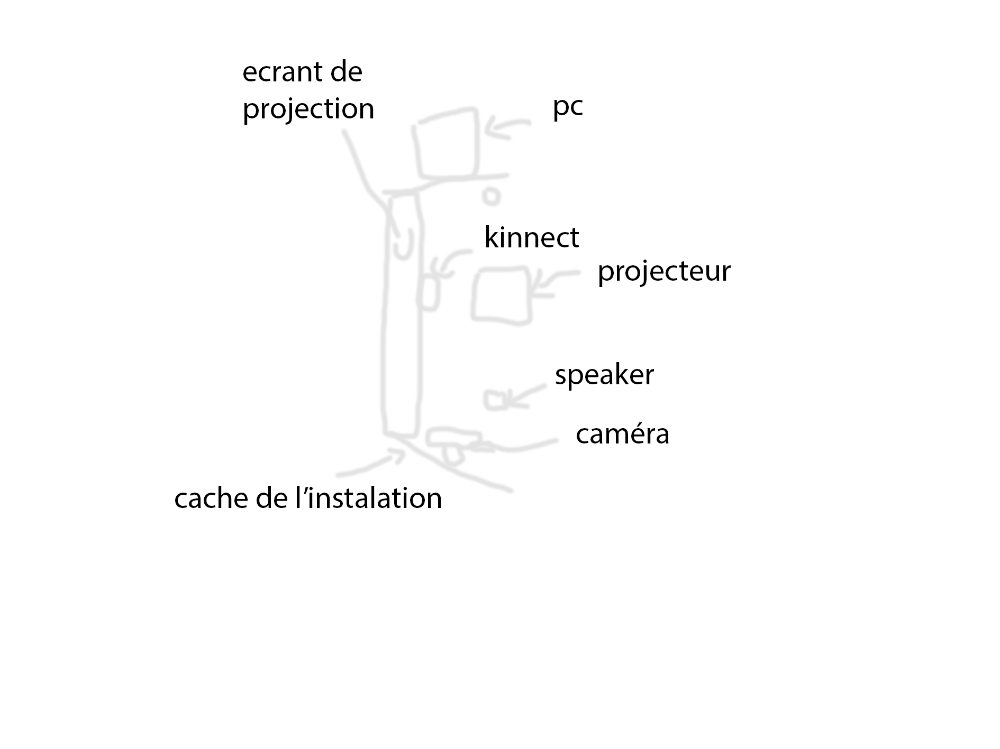
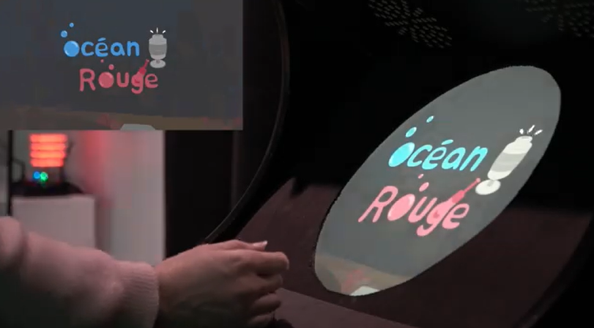
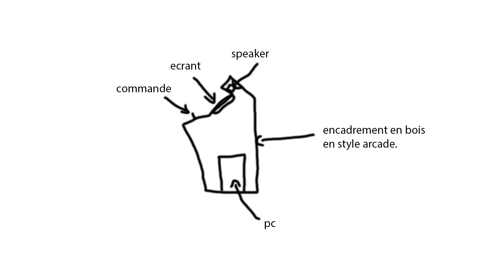
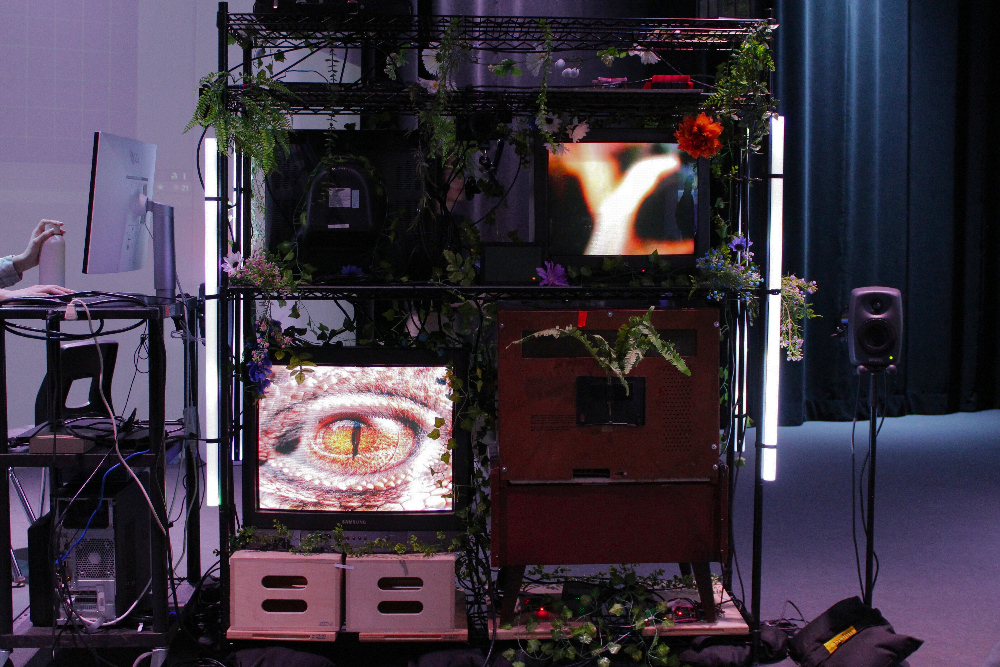
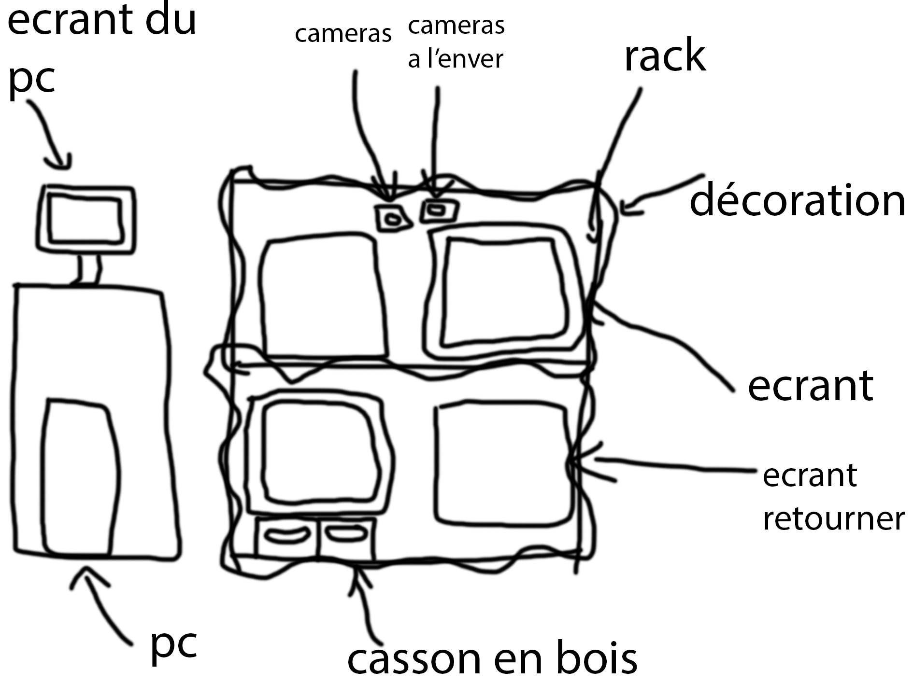
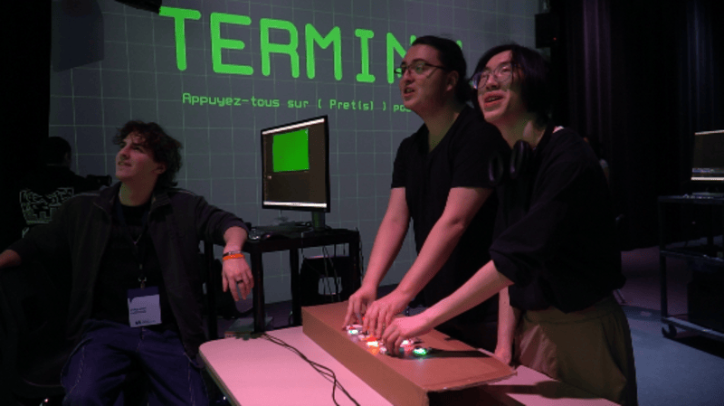
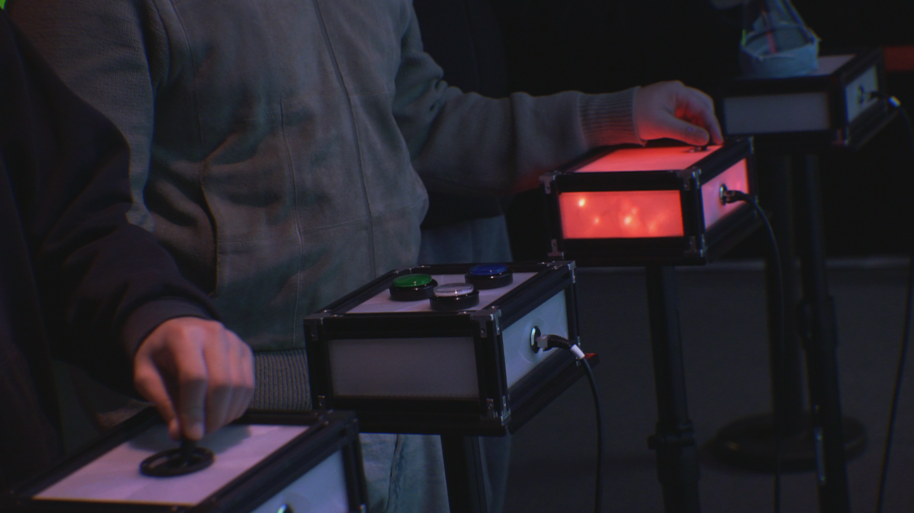
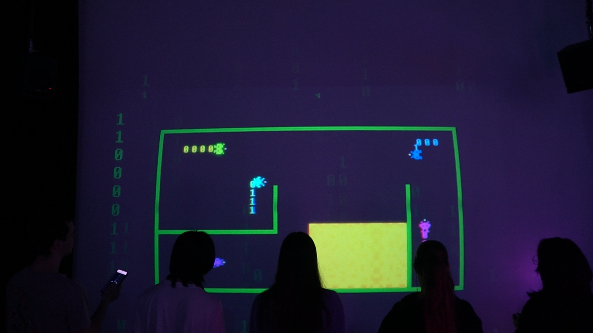
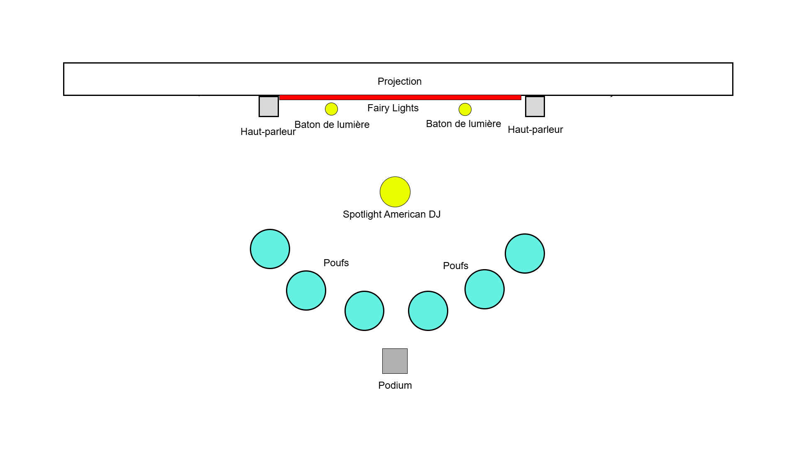

# Palmares des oeuvres de l'exposition "Réseaux Vivant" des étudiants finnisant de la technique d'integrations multimédia de montmorency. (Présenter dans le grand studio de l'aile c de montmorency)

## Petit mots de débuts
Je voulais commencer par dire que je pense sincèrement que tout les projets qui ont été présenter étais interessant et que je trouve que les élèves se sont tous surpacer. Mais malgrées tous certain se sont plus démarquer que d'autre pour moi alors voicie mon palmares !

## En 6 position: Arbre en face

### Créer par: 
Alexandre Gendron, 
Mikael Arseneau, 
Mathieu Willett, 
Matis Ghariani, 
Rafael Angon Dube

### Installation finale dans le studio.

### Shéma de l'installation (au niveaux théorique)

### Se que cette installation ma fais ressentir.
pas grand chose pour être honnete. Je me suis juste dit sa fonctionne mais sans plus.

#### Avant de faire l'installation:

Je dirais que la première fois que j'ai vue l'installation je ne savais pas trop faire de se que je voyais. Elles me semblais drolement "cheap" et je ne n'avais aucune ider de quoi faire sans les créateur a côter j'aurais perdue un moment sur l'insatallation a juste tenter de comprendre comment l'utiliser se qui (je trouve) est asser découragant pour une personnes qui est la pour tenter de vivre la totaliter de l'experience que l'installation peut donner.

#### Apres avoir fais le tour de l'installation:

Je dirais que mon regard a changer un peut. Se que jeveux dire par cela est que je comprend enfin un peut comment sa marche. Malheureusement le "fun" que j'ai eu avec cette installation a été très bref vue que le contenue quelle propose est très limiter (se termine en 30 seconde sans même se presser) se que je trouve asser desevant. De pus le fais que l'ont se fasse prendre en photo a l'entrer sans même avoir un avertisement (je pense) vas en frustrer plus d'un qui ne désirai pas se faire prendre en photo. Je pense aussie que l'installation est très propice a se faire facilement briser au vue du fait que la toiles sur l'aquelle le pojet est projeter est mince et vas être touche en tout temps, il sufirait que quelle qu'un perdre l'équillibre pour que la toile se fase déchirer. Un autre point que j'ai pas aimer, est que sans l'explication des créateur qui sont juste a côter de l'installation, elle devient imposible a utiliser. Se que je veux dire par la ses que je n'aurait jamais su quil fallais que je touche la toile dans un mouvement de bas ver le haut pour faire apparètre une fleur ses très louin de la première chose qui me passe a l'esprit en voyant cela. De plus un ordinateur avec un moniteur est présent sur le côter gauche de l'installation et honnetement je pense que sa aurait été interressant qu'ils fasse une petite interface pour démontrer la banque de photo qu'ils utilise sur le moment.

### 3 cour dans la technique qui sont utilliser dans cette installation.

#### 1: 
le cour de exposition multimédia qui selont moi aide a avoir des ider et a comprendre mieux commnet faire sa propre exposition.

#### 2:
Le cour d'animation 2d pour faire les animation sur l'écrant 
#### 3:
les cour de web en géneral pour la programation de l'interface et de leur site web
### Composante technique du projet que je ne connaissait pas:

#### Phyton

Ses le language de code qu'ils ont utiliser pour coder le programe qui récupère les données de la kineck pour les envoyer au programe qu'ils utilise pour l'affichage de l'interface qui est montrer a l'utilisateur.

## En 5 position: Océan Rouge

### Créer par: 
Amira Tounekti, 
Kristy Moussally

### Installation finale dans le studio.

### Shéma de l'installation (au niveaux théorique)

### Se que cette installation ma fais ressentir.
Je dirais que les 30 première seconde étais asser plaisant mais que apres en sen l'assait rapidement. 

#### Avant de faire l'installation:

Je dirais que la première fois que j'ai vue l'installation elle ma sembler pluto interresante au vue de sont style arcade qui me fesait poser l;a question de se qu'il avait fais a l'interieur. J'ai sensuite tester et sa marchais mais sans plus.

#### Apres avoir fais le tour de l'installation:

Je dirais que mon regard a pas vraiment changer sur se dispositif car sétait très similaire a l'exeption du fait que la vue étais plus petite ( se qui je pense étais pas une bonne ider) et que l'ont pouvais tourner se qui est bien mais il faut le remarquer car ses pas simple a remarker du tout.

### 3 cour dans la technique qui sont utilliser dans cette installation.

#### 1: 
le cour de exposition multimédia qui selont moi aide a avoir des ider et a comprendre mieux commnet faire sa propre exposition.
#### 2:
Le cour d'animation 2d pour faire les animation sur l'écrant du jeux 
#### 3:
le cour de programation intéractive pour relier les control au jeux (je pense)
### Composante technique du projet que je ne connaissait pas:

#### se que je connaissait pas
je connaissait apeupret tous se qui étais présenter côter technique sur cette instalation mais bon si je devrais en dire que une se serais: le code pour relier les commande au jeux que je n'ais pas trop comprit encore exactement comment faire.

## En 4 position: Quand les yeux se croisent

### Créer par: 
Félix Lavoie, 
Jade Hébert, 
Edelwyn Ledru, 
Manel Yaya, 
Patricia Nassif

### Installation finale dans le studio.

### Shéma de l'installation (au niveaux théorique)

### Se que cette installation ma fais ressentir.
je trouvais cela très estétique et cool quelle soit en mesure de nous faire aparaitre sur les ecrant mais après un petit moment a la regarder j'ai perdu un peut tout l'intèret que j'avait enver elle mais en général je dirais que sétais intéressant.
#### Avant de faire l'installation:

Je dirais que la première fois que j'ai vue l'installation je me demmandais se quelle pouvais bien avoir comme coter intéractif quelle aportais et je me dommandais a quoi servait les marques sur le plancher mais bon j'ai eu ma réponse asser vite.
#### Apres avoir fais le tour de l'installation:

Je dirais que mon regard a pas changer du tout. L'instalation a pas vraiment changer apart le fais quelle peut maintennant intéragir des deux côter, se qui est bien mais je dirais que sa a rien changer en raport a l'expérience quelle fesait vivre dans sa forme expérimentale.

### 3 cour dans la technique qui sont utilliser dans cette installation.

#### 1: 
le cour de exposition multimédia qui selont moi aide a avoir des ider et a comprendre mieux commnet faire sa propre exposition.
#### 2:
Interactivité ludique pour les présentations des expériences visuelles qui apparaice et disparaice.
#### 3:
le cour de design graphique qui doit durement aider a faire le côter esthétique de l'instaltion. 
### Composante technique du projet que je ne connaissait pas:

#### se que je connaissait pas
je connaissait pas touch designer et sa ma permit de voir un peut se qu'il pouvait permettre de faire. 

## En 3 position: Mission Décollage

### Créer par: 
Ahmed Kaissoumi, 
Radhouane Kordan, 
Justin Montpetit, 
Thearylou Lach, 
Jad Saloumi

### Installation finale dans le studio.

### Shéma de l'installation (au niveaux théorique)

### Se que cette dispositif ma fais ressentir.
Ce dispositif ma fait ressentir un petit "rush" d'adrénaline due au fait que je me suis retrouver face a un défit. Se qui n'as pas durer longtemp malheureusement, apret l'avoir batue j'ai perdut rapidement l'interet que j'avais dans le dispositif. Mais le fait de voir les autres tenter étais asser "fun" je dirais. je pense que je décrirais cela par une expérience social, ce que je veux dire par cela ses que ceux qui avait réussie tentais d'aider les autres a réussir aussie. Se comme le dispositif tentais de démontrer que l'humain tente tout le temps de s'entre aider dans des moment de difficulter commun. 
#### Avant de faire l'installation:

Je dirais que la première fois que j'ai vue l'installation je ne savais pas trop faire de se que je voyais. Elles me semblais drolement "cheap" et je ne n'avais aucune ider de quoi faire sans les créateur a côter j'aurais perdue un moment sur l'insatallation a juste tenter de comprendre comment l'utiliser se qui (je trouve) est asser découragant pour une personnes qui est la pour tenter de vivre la totaliter de l'experience que l'installation peut donner.

#### Apres avoir fais le tour de l'installation:

Je dirais que mon regard a changer un peut. Mais bon il reste pareil sur presque tout les aspects. Je dirais que les seuls chose qui ont changer serait le fait qu'ils ont rendus le jeux beaucoup plus simple, se que je trouve asser dommage car sétais un des seul point qui donnais envie d'utiliser le dispositif. Ils ont aussie rajouter des animation de lancement et autre pour rendre cela plus beaux mais sinon sesrester identique 

### 3 cour dans la technique qui sont utilliser dans cette installation.

#### 1: 
le cour de exposition multimédia qui selont moi aide a avoir des ider et a comprendre mieux commnet faire sa propre exposition.
#### 2:

#### 3:

### Composante technique du projet que je ne connaissait pas:

#### Phyton

Ses le language de code qu'ils ont utiliser pour coder le programe qui récupère les données de la kineck pour les envoyer au programe qu'ils utilise pour l'affichage de l'interface qui est montrer a l'utilisateur.

## En 2 position: Symbiose

### Créer par: 
Yannick Chamberland, 
Benjamin Ferland, 
Ryan Dufault, 
Walid Cheour

### Installation finale dans le studio.

### Shéma de l'installation (au niveaux théorique)

### Se que cette installation ma fais ressentir.
ce dispositif ma fait resentir un côter défit (qui ma grandement plus) et un côter un peut plus social qui je trouve aportais le charme de l'oeuvre car tu pouvais faire plusieur fois le dispositif en aillant jamais la même expérience (due au fait que l'expérience se fait a plusieur et qu'ils y a 4 stations diférente). En résumer j'ai bien aimer l'instalation vue qu'elle rendais la nécésiter de faire confiance a d'autre personne de faire leur par a eu dans le défit que se tenais devant le groupe.
#### Avant de faire l'installation:

Je dirais que la première fois que j'ai vue l'installation je ne savais pas exactement se qu'il y aurait a faire avec chacunne des stations qui étais devant l'écrant. Parcontre, j'ai remarquer insttentanément qu'il sajisait d'une forme de jeux vidéo qui devait être jouer par plusieur personne en même temps.  

#### Apres avoir fais le tour de l'installation:

Je dirais que mon regard a changer un peut.

### 3 cour dans la technique qui sont utilliser dans cette installation.

#### 1: 
le cour de exposition multimédia qui selont moi aide a avoir des ider et a comprendre mieux commnet faire sa propre exposition.
#### 2:

#### 3:

### Composante technique du projet que je ne connaissait pas:

#### Phyton

Ses le language de code qu'ils ont utiliser pour coder le programe qui récupère les données de la kineck pour les envoyer au programe qu'ils utilise pour l'affichage de l'interface qui est montrer a l'utilisateur.

## En 1 position: TERMINAL

### Créer par: 
Émeryk Bélisle, 
Elie Daher, 
Ting Yung Lu Terry, 
Dana Saavedra-Torrano, 
Mégane Ranger

### Installation finale dans le studio.

### Shéma de l'installation (au niveaux théorique)

### Se que cette installation ma fais ressentir.

#### Avant de faire l'installation:

Je dirais que la première fois que j'ai vue l'installation je savais tous de suite se que cétais ou environt vue que les poufs sont placer d'une facont qui démontre de fasont naturelle que l'écrant qui est juste devant seu ci serat utiliser par plusieur personne en  même temps. De plus, des instructions sont placer de manière a se quelle soit visible et jjuste devant un dispositif qui flache se qui attire l'attention et les rend très durs a rater. L'interface mets en confiance au vue du fait quelle suit une logique et un style qui est asser récurant dans le domaine du jeux vidéo se qui aide a donner l'ider que l'installation ais un côter un interractif.

#### Apres avoir fais le tour de l'installation:

J'ai adorer, l'installation a un côter social qui donne l'impression que tout le monde travaille dans un même buts se qui la rend drolement plaisante (sa donne l'impression d'être dans un petit évenement de lan). Sinon les poufs sont confortable et je vois dificilement comment l'installation pourrait être mise hors d'étas de service par accidents. De plus, je trouve que le fais d'avoir penser au plusieur possibiliter de problème de connection que l'utilisateur pourait rencontrer en créer un réseaux local pour prendre en charge l'installation. Dailleur l'interface sur les téléphones étais simple mais bien penser avec des flèche qui rendre la direction asser simple contrerement a la première version qui étais passable mais qui étais bien mouin intuitive.

### 3 cour dans la technique qui sont utilliser dans cette installation.

#### 1: 
le cour de exposition multimédia qui selont moi aide a avoir des ider et a comprendre mieux commnet faire sa propre exposition.
#### 2:

#### 3:

### Composante technique du projet que je ne connaissait pas:

#### Infrastructure de network local

Ses tous simplement un signals wi-fi (comme tous les autres) qui sert a se connecter au pc pour avoirs accès a (si j'ai bien comprit) un serveur locale qui host un domaine qui est relier au commande du jeux et qui sépare les personne par id ou ip (je sais pas trop)
