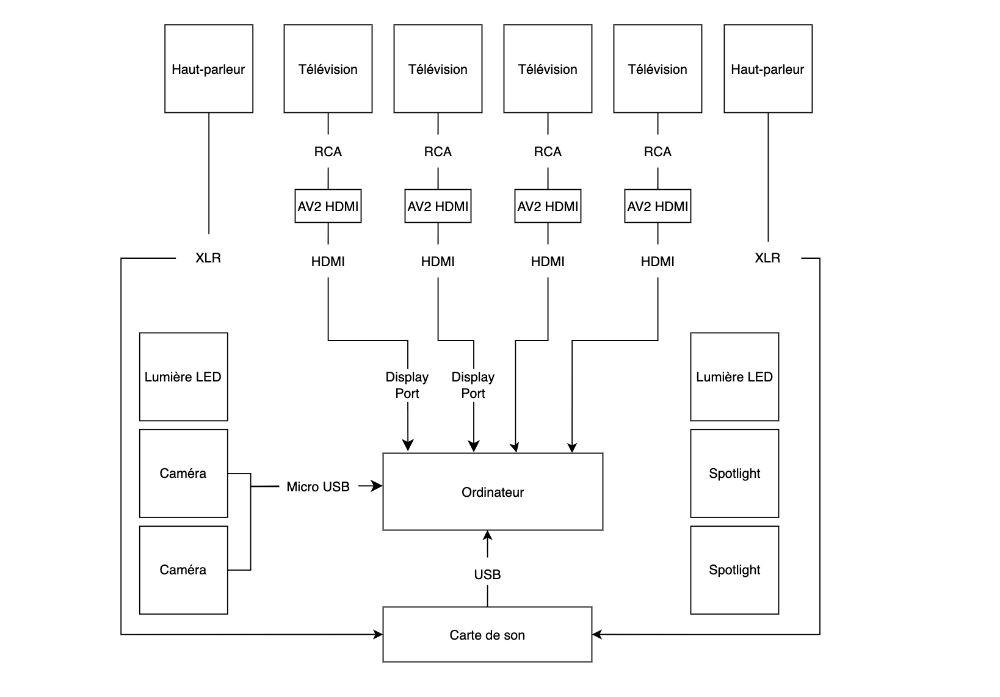

# Palmarès des œuvres de l'exposition "Réseaux Vivant" des étudiants finissants de la technique d'intégration multimédia de Montmorency (Présenter dans le grand studio de l'aile C de Montmorency)

## Petits mots de début

Je voulais commencer par dire que je pense sincèrement que tous les projets qui ont été présentés étaient intéressants et que je trouve que les élèves se sont tous surpassés Mais malgré tout, certains se sont plus démarqués que d'autres pour moi, alors voici mon palmarès !

## En 6 position : Arbre en face

### Créé par : 

Alexandre Gendron, 

Mikael Arseneau, 

Mathieu Willett, 

Matis Ghariani, 

Rafael Angon Dube

### Installation finale dans le studio.

Photo de l'installation finale du dispositif / Photo prise sur leur site web.

### Schéma de l'installation (au niveau théorique)

Croquis du dispositif / Photo prise sur leur site web.

### Ce que cette installation m'a fait ressentir.

Pas grand-chose pour être honnête Je me suis juste dit : ça fonctionne, mais sans plus.

#### Avant de faire l'installation :

Je dirais que la première fois que j'ai vu l'installation, je ne savais pas trop faire de ce que je voyais. Elles me semblaient drôlement "cheap" et je n'avais aucune idée de quoi faire sans les créateurs à côté. J'aurais perdu un moment sur l'installation à juste tenter de comprendre comment l'utiliser, ce qui (je trouve) est assez décourageant pour une personne qui est là pour tenter de vivre la totalité de l'expérience que l'installation peut donner.

#### Après avoir fait le tour de l'installation :

Je dirais que mon regard a changé un peu Ce que je veux dire par cela, c'est que je comprends enfin un peu comment ça marche. Malheureusement le "fun" que j'ai eu avec cette installation a été très bref vu que le contenu qu'elle propose est très limité (se termine en 30 secondes sans même se presser), ce que je trouve assez décevant. De plus, le fait qu'on se fasse prendre en photo à l'entrée sans même avoir un avertissement (je pense) va en frustrer plus d'un qui ne désirait pas se faire prendre en photo. Je pense aussi que l'installation est très propice à se faire facilement briser au vu du fait que la toile sur laquelle le projet est projeté est mince et va être touchée en tout temps. Il suffirait que quelqu'un perde l'équilibre pour que la toile se fasse déchirer. Un autre point que j'ai pas aimé, c'est que sans l'explication des créateurs qui sont juste à côté de l'installation, elle devient impossible à utiliser. Ce que je veux dire par là, c'est que je n'aurais jamais su qu'il fallait que je touche la toile dans un mouvement de bas vers le haut pour faire apparaître une fleur. C'est très loin de la première chose qui me passe par l'esprit en voyant cela. De plus un ordinateur avec un moniteur est présent sur le côté gauche de l'installation et honnêtement je pense que ça aurait été intéressant qu'ils fassent une petite interface pour démontrer la banque de photos qu'ils utilisent sur le moment.

### 3 cours dans la technique qui sont utilisés dans cette installation.

#### 1 : 

le cours d'exposition multimédia qui, selon moi, aide à avoir des idées et à comprendre mieux comment faire sa propre exposition.

#### 2 :

Le cours d'animation 2D pour faire les animations sur l'écran 

#### 3 :

les cours de web en général pour la programmation de l'interface et de leur site web

### Composante technique du projet que je ne connaissais pas :

#### Python

C'est le langage de code qu'ils ont utilisé pour coder le programme qui récupère les données de la Kinect pour les envoyer au programme qu'ils utilisent pour l'affichage de l'interface qui est montrée à l'utilisateur.

## En 5 positions : Océan rouge

### Créé par : 

Amira Tounekti, 

Kristy Moussally

### Installation finale dans le studio.

Photo de l'installation finale du dispositif / Photo prise sur leur site web.

### Schéma de l'installation (au niveau théorique)

Croquis du dispositif / Photo prise sur leur site web.

### Ce que cette installation m'a fait ressentir.

Je dirais que les 30 premières secondes étaient assez plaisantes, mais qu'après on s'en lassait rapidement. 

#### Avant de faire l'installation :

Je dirais que la première fois que j'ai vu l'installation, elle m'a plutôt semblé intéressante au vu de son style arcade qui me faisait poser la question de ce qu'il avait fait à l'intérieur. J'ai ensuite testé et ça marchait, mais sans plus.

#### Après avoir fait le tour de l'installation :

Je dirais que mon regard a pas vraiment changé sur ce dispositif car c'était très similaire à l'exception du fait que la vue était plus petite (ce qui, je pense, n'était pas une bonne idée) et que l'on pouvait tourner, ce qui est bien, mais il faut le remarquer car c'est pas simple à remarquer du tout.

### 3 cours dans la technique qui sont utilisés dans cette installation.

#### 1 : 

le cours d'exposition multimédia qui, selon moi, aide à avoir des idées et à comprendre mieux comment faire sa propre exposition.

#### 2 :

Le cours d'animation 2D pour faire les animations sur l'écran du jeu 

#### 3 :

Le cours de programmation interactive pour relier les contrôles aux jeux (je pense).

### Composante technique du projet que je ne connaissais pas :

#### ce que je connaissais pas

Je connaissais à peu près tout ce qui était présenté côté technique sur cette installation, mais bon, si je devais en dire qu'une, ce serait : le code pour relier les commandes au jeu, que je n'ai pas trop compris encore exactement comment faire.

## En 4 positions : Quand les yeux se croisent

### Créé par : 

Félix Lavoie, 

Jade Hébert, 

Edelwyn Ledru, 

Manel Yaya, 

Patricia Nassif

### Installation finale dans le studio.

Photo de l'installation finale du dispositif / Photo prise sur leur site web.

### Schéma de l'installation (au niveau théorique)

Croquis du dispositif / Photo prise sur leur site web.

### Ce que cette installation m'a fait ressentir.

Je trouvais cela très esthétique et cool qu'elle soit en mesure de nous faire apparaître sur les écrans, mais après un petit moment à la regarder, j'ai perdu un peu tout l'intérêt que j'avais envers elle, mais en général je dirais que c'était intéressant.

#### Avant de faire l'installation :

Je dirais que la première fois que j'ai vu l'installation, je me demandais ce qu'elle pouvait bien avoir comme côté interactif, ce qu'elle apportait, et je me demandais à quoi servaient les marques sur le plancher, mais bon, j'ai eu ma réponse assez vite.

#### Après avoir fait le tour de l'installation :

Je dirais que mon regard a pas changé du tout. L'installation a pas vraiment changé à part le fait qu'elle peut maintenant interagir des deux côtés, ce qui est bien, mais je dirais que ça a rien changé par rapport à l'expérience qu'elle faisait vivre dans sa forme expérimentale.

### 3 cours dans la technique qui sont utilisés dans cette installation.

#### 1 : 

le cours d'exposition multimédia qui, selon moi, aide à avoir des idées et à comprendre mieux comment faire sa propre exposition.

#### 2 :

Interactivité ludique pour les présentations des expériences visuelles qui apparaissent et disparaissent.

#### 3 :

le cours de design graphique qui doit durement aider à faire le côté esthétique de l'installation. 

### Composante technique du projet que je ne connaissais pas :

#### ce que je connaissais pas

Je connaissais pas TouchDesigner et ça m'a permis de voir un peu ce qu'il pouvait permettre de faire. 

## En 3 positions : Mission Décollage

### Créé par : 

Ahmed Kaissoumi, 

Radhouane Kordan, 

Justin Montpetit, 

Thearylou Lach, 

Jad Saloumi

### Installation finale dans le studio.

Photo de l'installation finale du dispositif / Photo prise sur leur site web.

### Schéma de l'installation (au niveau théorique)

Croquis du dispositif / Photo prise sur leur site web.

### Ce que ce dispositif m'a fait ressentir.

Ce dispositif m'a fait ressentir un petit "rush" d'adrénaline dû au fait que je me suis retrouvé face à un défi Ce qui n'a pas duré longtemps malheureusement, après l'avoir battue, j'ai perdu rapidement l'intérêt que j'avais dans le dispositif. Mais le fait de voir les autres tenter était assez "fun", je dirais. Je pense que je décrirais cela par une expérience sociale, ce que je veux dire par cela, c'est que ceux qui avaient réussi tentaient d'aider les autres à réussir aussi C'est comme si le dispositif tentait de démontrer que l'humain tente tout le temps de s'entraider dans des moments de difficulté commune. 

#### Avant de faire l'installation :

Je dirais que la première fois que j'ai vu l'installation, je ne savais pas trop faire de ce que je voyais. Elles me semblaient drôlement "cheap" et je n'avais aucune idée de quoi faire sans les créateurs à côté. J'aurais perdu un moment sur l'installation à juste tenter de comprendre comment l'utiliser, ce qui (je trouve) est assez décourageant pour une personne qui est là pour tenter de vivre la totalité de l'expérience que l'installation peut donner.

#### Après avoir fait le tour de l'installation :

Je dirais que mon regard a changé un peu Mais bon il reste pareil sur presque tous les aspects. Je dirais que les seules choses qui ont changé seraient le fait qu'ils ont rendu le jeu beaucoup plus simple, ce que je trouve assez dommage car c'était un des seuls points qui donnait envie d'utiliser le dispositif. Ils ont aussi rajouté des animations de lancement et autres pour rendre cela plus beau, mais sinon c'est resté identique. 

### 3 cours dans la technique qui sont utilisés dans cette installation.

#### 1 : 

le cours d'exposition multimédia qui, selon moi, aide à avoir des idées et à comprendre mieux comment faire sa propre exposition.

#### 2 :

le cours d'illustration numérique pour le design graphique des assets 2D sur Photoshop.

#### 3 :

### Composante technique du projet que je ne connaissais pas :

#### Pure Data

C'est un logiciel qu'ils ont utilisé pour faire la gestion de l'OSC et le transfert des données reçues de l'Arduino vers Unity.

## En 2 position : Symbiose

### Créé par : 

Yannick Chamberland , 

Benjamin Ferland , 

Ryan Dufault, 

Walid Cheour

### Installation finale dans le studio.

Photo de l'installation finale du dispositif / Photo prise sur leur site web.

### Schéma de l'installation (au niveau théorique)

Croquis du dispositif / Photo prise sur leur site web.

### Ce que cette installation m'a fait ressentir.

Ce dispositif m'a fait ressentir un côté défi (qui m'a grandement plu) et un côté un peu plus social qui, je trouve, apportait le charme de l'œuvre car tu pouvais faire plusieur fois le dispositif en ayantplusieurs jamais la même expérience (due au fait que l'expérience se fait à plusieurs et qu'il y a 4 stations différentes En résumé, j'ai bien aimé l'installation, vu qu'elle rendait nécessaire de faire confiance à d'autres personnes, de faire leur part à eux dans le défi qui se tenait devant le groupe.

#### Avant de faire l'installation :

Je dirais que la première fois que j'ai vu l'installation, je ne savais pas exactement ce qu'il y aurait à faire avec chacune des stations qui étaient devant l'écran. Par contre, j'ai remarqué instantanément qu'il s'agissait d'une forme de jeu vidéo qui devait être joué par plusieurs personnes en même temps.  

#### Après avoir fait le tour de l'installation :

Je dirais que mon regard a changé un peu Mais je dirais que j'ai bien apprécié l'expérience. Je trouve que la coordination ou le travail d'équipe demandés pour utiliser le dispositif est bien pensé selon moi. Je trouve aussi que les informations nécessaires à comprendre pour avancer sont assez bien démontrées de façon graphique sur l'écran. Le seul point que je trouve un peu dommage est que la fiole à verser est loin d'être calibrée pour être intuitive.

### 3 cours dans la technique qui sont utilisés dans cette installation.

#### 1 : 

le cours d'exposition multimédia qui, selon moi, aide à avoir des idées et à comprendre mieux comment faire sa propre exposition.

#### 2 :

le cours d'audio 1 pour la composition audio qui est jouée durant l'interaction.

#### 3 :

le cours d'illustration numérique pour le design graphique des assets sur Photoshop.

### Composante technique du projet que je ne connaissais pas :

#### Maya / Blender

C'est des logiciels de modélisation 3D que je ne connais pas vraiment et qui servent à designer beaucoup de chose dans les projets.

## En 1 position :choses TERMINAL

### Créé par : 

Émeryk Bélisle, 

Elie Daher, 

Ting Yung Lu Terry, 

Dana Saavedra-Torrano, 

Mégane Ranger

### Installation finale dans le studio.

Photo de l'installation finale du dispositif / Photo prise sur leur site web.

### Schéma de l'installation (au niveau théorique)

Croquis du dispositif / Ses photos ont été prises sur leur site web.

### Ce que cette installation m'a fait ressentir.

#### Avant de faire l'installation :

Je dirais que la première fois que j'ai vu l'installation, je savais tout de suite ce que c'était, ou environ, vu que les poufs sont placés d'une façon qui démontre de façon naturelle que l'écran qui est juste devant sera utilisé par plusieurs personnes en  même temps. De plus, des instructions sont placée de manière à ce qu'elles soient visibles et juste devant un dispositif qui flashe, ce qui attire l'attention et les rend très dures à rater. L'interface met en confiance au vu du fait qu'elle suit une logique et un style qui est assez récurrent dans le domaine du jeu vidéo, ce qui aide à donner l'idée que l'installation a un côté interactif.

#### Après avoir fait le tour de l'installation :

J'ai adoré, l'installation a un côté social qui donne l'impression que tout le monde travaille dans un même but, ce qui la rend drôlement plaisante (ça donne l'impression d'être dans un petit événement de lan). Sinon les poufs sont confortables et je vois difficilement comment l'installation pourrait être mise hors d'état de service par accident De plus, je trouve que le fait d'avoir pensé aux plusieurs possibilités de problème de connexion que l'utilisateur pourrait rencontrer en créant un réseau local pour prendre en charge l'installation. D'ailleurs l'interface sur les téléphones était simple mais bien pensée avec des flèches qui rendaient la direction assez simple, contrairement à la première version qui était passable mais qui était bien moins intuitive.

### 3 cours dans la technique qui sont utilisés dans cette installation.

#### 1 : 

le cours d'exposition multimédia qui, selon moi, aide à avoir des idées et à comprendre mieux comment faire sa propre exposition.

#### 2 :

le cours d'audio 1 pour la composition audio qui est jouée durant l'interaction.

#### 3 :

le cours de modélisation 3D pour la réalisation des croquis pour la réalisation du projet.

### Composante technique du projet que je ne connaissais pas :

#### Infrastructure de réseau local

C'est tout simplement un signal Wi-Fi (comme tous les autres) qui sert à se connecter au PC pour avoir accès à (si j'ai bien compris) un serveur local qui hoste un domaine qui est relié aux commandes du jeu et qui sépare les personnes par ID ou IP (je sais pas trop).

